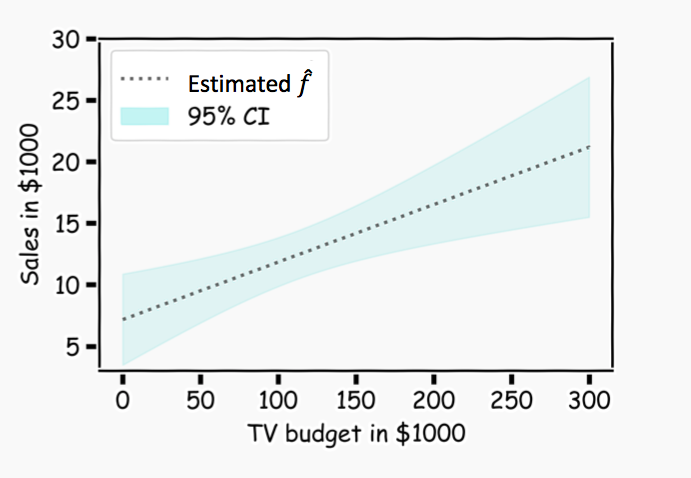
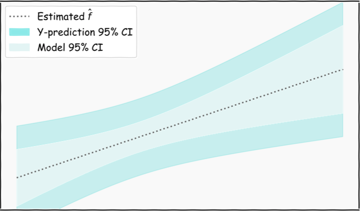
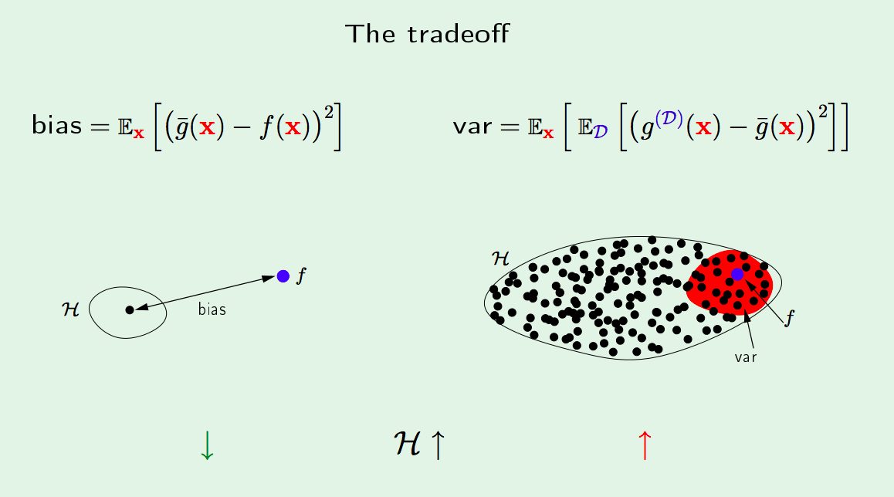
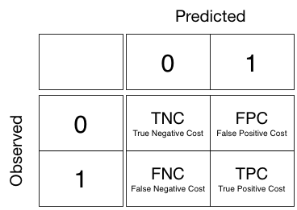

footer:
autoscale: true

##[fit] Classification 
##[fit] Metrics and Risk

---

---

#[fit] Ai 1

---

## Last time

1. Multiple Regression and Dimensionality
2. Classification
3. Logistic Regression

---

## This time

0. Feature Selection
1. Metrics
2. Predictive distributions (back to regression)
3. Bayes Risk (for regression)
4. Bayes Risk for Classification
5. Asymmetric case
6. ROC curves and cost curves

---

## Units based diagram

---

## 1-D Using Logistic regression

---

#DISCRIMINATIVE CLASSIFIER
$$P(y|x): P(male | height, weight)$$

---

## 0. Feature Selection

- Remember the curse of dimensionality
- it can show up as a large number of "power features", such as $$x^{356}$$, or it can show up as many "actual features": 224x224 in Imagenet for example
- can tame with regularization
- or with explicit feature selection
- another way: would it not be better to have a classifier that captured the generative process

---

- We do generative models later in Ai2
- Can use Regularization for feature selection
- Lasso, aka L1 regularization , or $$\sum_i | w_i | < C$$ sets some coefficients to exactly 0 and can thus be used for feature selection
- We can also use `SelectKBest`
- We can also do forward-backward feature selection.

Which set should such stuff be done on?

---

##[fit] 1. EVALUATING CLASSIFIERS

---

## Confusion Matrix

---

## Metrics (from Glassner)

- accuracy is a number from 0 to 1. It’s a general measure of how often the prediction is correct.
- visually looking at the confusion matrix is another important way to evaluate
- Precision (also called positive predictive value, or PPV) tells us the percentage of our samples that were properly labeled “positive,” relative to all the samples we labeled as “positive.” Numerically, it’s the value of TP relative to TP+FP. In other words, precision tells us how many of the “positive” predictions were really positive.
- recall, (also called sensitivity, hit rate, or true positive rate). This tells us the percentage of the positive samples that we correctly labeled.
- F1 score is the harmonic mean of precision and recall. Generally speaking, the f1 score will be low when either precision or recall is low, and will approach 1 when both measures also approach 1.

---

## Metrics (example)

Lets understand the various metrics on this example

---

## Simple metrics

---

## Baselines

Its important in predictions to make baselines and see if you can beat them.

The simplest baselines are all positives and all negatives.

For a balanced dataset, these models only have 50% accuracy.

It should be easy to beat these with the simplest logistic regression, which can then serve as a baseline

---

## Is accuracy the correct metric?

For example, consider a fraud situation in which there is only 1% fraud.

Thean a classifier predicting that there is no fraud has 99% accuracy.

Then the question arises: is accuracy the best metric?

We will come back to this towards the end.

---

##[fit] 2. Back to Regression:
##[fit] Prediction and the mean

---

## Prediction vs Possible Prediction

- In machine learning we do not care too much about the functional form of our prediction $$\hat{y} = \hat{f}(x)$$, as long as we predict "well"
- Remember however our origin story for the data: the measured $$y$$ is assumed to have been a draw from a gaussian distribution at each x: this means that our prediction at an as yet not measured x should also be a draw from such a gaussian
- Still, we use the mean value of the gaussian as the value of the "prediction", but note that we can have many "predicted" data sets, all consistent with the original data we have
- This means that there is an additional "smear" to that of the regression line...

---

---

## From Likelihood to Predictive Distribution

- the band on the previous graph is the sampling distribution of the regression line, or a representation of the sampling distribution of the $$\mathbf{w}$$.
- $$p(y \vert \mathbf{x},  \mu_{MLE}, \sigma^2_{MLE})$$ is a probability distribution
- thought of as $$p(y^{*} \vert \mathbf{x}^*, \{ \mathbf{x}_i, y_i\},  \mu_{MLE}, \sigma^2_{MLE})$$, it is a predictive distribution for as yet unseen data $$y^{*}$$ at $$\mathbf{x}^{*}$$, or the sampling distribution for data, or the data-generating distribution, at the new covariates $$\mathbf{x}^{*}$$. This is a wider band.

---

## Mean vs Prediction

---

## The two risks, or rather risk and score

When we estimate a model using maximum likelihood converted to a risk (how? by NLL) we are calling this risk an **estimation risk**. 

Scoring is a different enterprise, where we want to compare different models using their **score** or **decision risk**

The latter leads to the idea of the **Bayes Model**, the best you can do..

---

## The notion of Bayes Risk

$$R^{*} = \inf_h R_{out}(h)  = \inf_h \int dx p(x,y)  (h(x) - y)^2 .$$

Its the minimum risk **ANY** model can achieve.

Want to get as close to it as possible.

Could infimum amongst all possible functions. OVERFITTING!

Instead restrict to a particular Hypothesis Set: $${\cal H}$$.

---

##[fit] 3. Bayes Risk (Regression)

---

## Bayes Risk for Regression

$$R_{out}(h)  = \int dx p(x,y)  (h(x) - y)^2 .$$

$$ = E_{X} E_{Y|X}[(h-y)^2] = E_X E_{Y|X} [(h - r + r -y)^2]$$

where $$r(x) = E_{Y|X}[y]$$ is the "regression" function.

$$R_{out}(h)  = E_{X}[(h-r)^2] + R^{*}; R^{*} = E_{X} E_{Y|X}[(r-y)^2]$$

---

For 0 mean, finite variance, then, $$\sigma^2$$, the noise of $$\epsilon$$,  is the Bayes Risk, also called the irreducible error.

Note that:

- We are never given a population, rather we get a training set. 
- Now, varying training sets make $$R_{out}(h)$$ a stochastic quantity, varying from one training set to another, since a  different model is fit on each set!
- **Goal of Learning**: Build a function whose risk is closest to Bayes Risk, on our training set

---

$$
\renewcommand{\gcald}{g_{\cal D}}
\renewcommand{\ecald}{E_{\cal{D}}}
\langle  R \rangle = E_{\cal{D}} [R_{out}(\gcald)] =  E_{\cal{D}}E_{p(x,y)}[(\gcald(x) - y)^2]
$$

$$
\renewcommand{\gcald}{g_{\cal D}}
\renewcommand{\ecald}{E_{\cal{D}}}
\bar{g} = \ecald[\gcald] = (1/M)\sum_{\cal{D}} \gcald
$$. Then,

$$
\renewcommand{\gcald}{g_{\cal D}}
\renewcommand{\ecald}{E_{\cal{D}}}
\langle  R \rangle =  E_{p(x)}[\ecald[(\gcald - \bar{g})^2]] + E_{p(x)}[(f - \bar{g})^2] + \sigma^2
$$

where $$y = f(x) + \epsilon$$ is the true generating process and $$\epsilon$$ has 0 mean and finite variance $$\sigma^2$$.

---

---

$$
\renewcommand{\gcald}{g_{\cal D}}
\renewcommand{\ecald}{E_{\cal{D}}}
\langle  R \rangle =  E_{p(x)}[\ecald[(\gcald - \bar{g})^2]] + E_{p(x)}[(f - \bar{g})^2] + \sigma^2
$$

This is the bias variance decomposition for regression.

- first term is **variance**, squared error of the various fit g's from the average g, the hairiness.
- second term is **bias**, how far the average g is from the original f this data came from.
- third term is the **stochastic noise**, minimum error that this model will always have.

---

---

## What is $$p(x,y)$$?: Empirical Risk Minimization

- We dont know $$p(x,y)$$, otherwise why are we bothering? 
- We want to fit a hypothesis $$h = g_{\cal D}$$, where $$\cal{D}$$ is our training sample.
- So use empirical distribution on our sample as our best estimate of $$p(x, y)$$
- $$\hat{p}(x, y)  = \frac{1}{N} \sum_{ i \in {\cal D}} \delta(x - x_i) \delta(y - y_i)$$
- Then $$R_{out}(h)  = \frac{1}{N} \sum_{ i \in {\cal D}}  (h(x_i) - y_i )^2$$ and minimize to get $$g_{\cal D}(x)$$

---

##[fit] 4. Bayes Risk (Classification)

---

## Classification Risk

$$ R_{h}(x) = \sum_y l(y,h(x)) p(y|x)$$

That is, we calculate the **predictive averaged risk** over all choices y, of making choice h for a given data point.

Overall risk, given all the data points in our set:

$$R(h) = \sum_x R_{h}(x)$$ Find best fit $$h = g_{{\cal D}}$$.

---

## Two class Classification

$$R_g(x) = l(1, g)p(1|x) + l(0, g)p(0|x).$$

Then for the "decision" $$g=1$$ we have:

$$R_1(x) = l(1,1)p(1|x) + l(0,1)p(0|x),$$

and for the "decision" $$g=0$$ we have:

$$R_0(x) = l(1,0)p(1|x) + l(0,0)p(0|x).$$

---

#CLASSIFICATION RISK

- $$R_{g_\cal{D}}(x) = P(y=1 | x) \ell(y=1, g) + P(y=0 | x) \ell(y=0, g) $$
- The usual loss is the 1-0 loss $$\ell = \mathbb{1}_{g \ne y}$$. (over all points $$\frac{1}{n} \sum_{i}^{n} I\left(y_{i}=\hat{y}_{i}\right)$$)
- Thus, $$R_{g=1}(x) = P(y=0 |x)$$ and $$R_{g=0}(x) = P(y=1 |x)$$ at given $$x$$

       CHOOSE CLASS WITH LOWEST RISK

Choose $$g_{{\cal D}}=1$$ if $$R_1 \le R_0 \implies$$ 1 if $$P(0 | x) \le P(1 |x)$$ at given $$x$$.

       **choose 1 if $$P(1|x) \ge 0.5$$ ! Intuitive!**

---

Telecom customer Churn data set from @YhatHQ[^<]

[^<]: http://blog.yhathq.com/posts/predicting-customer-churn-with-sklearn.html

---

## Two class Classification with asymmetric risks

Now, we'd choose $$1$$ for the data point at $$x$$ if:

$$R_1(x) \lt R_0(x).$$

$$ P(1|x)(l(1,1) - l(1,0)) \lt p(0|x)(l(0,0) - l(0,1))$$

So, to choose '1', the Bayes risk can be obtained by setting:

$$p(1|x) \gt r P(0|x) \implies r=\frac{l(0,g=1) - l(0,g=0)}{l(1,g=0) - l(1,g=1)}$$

$$P(1|x) \gt t = \frac{r}{1+r}$$.

---

# $$ r   =\frac{c_{FP} - c_{TN}}{c_{FN} - c_{TP}}$$

---

## Bias, Variance, and Bayes risk

*Suppose you hope to build a cat recognizer that has 5% error. Right now, your training set has an error rate of 15%, and your dev set has an error rate of 16%.*

Will adding training data help?

What should you focus your energies on?

(the next few slides are from Andrew Ng's Machine Learning Yearning)

---

## Bias and Variance, informally:

We break the 16% error into two components:

- First, the algorithm’s error rate on a very large training set. In this example, it is 15%. We think of this informally as the algorithm’s  bias .
- Second, how much worse the algorithm does on the dev (or test) set than the training set. In this example, it does 1% worse on the dev set than the training set. We think of this informally as the algorithm’s  variance 

---

## Question:

Suppose your algorithm to classify cats performs as follows:
- Training error = 1%
- Dev(Validation) error = 11%

What problem do you have?

Now consider this:
- Training error = 15%
-  Dev error = 16%

What problem do you have? Are you sure?

---

## Why is Bayes Risk important?

It introduces us to the idea of the best possible classifier/regressor.  This is an even more important idea.

The Bayes Risk is the "unavoidable bias". The optimal error rate. When we said earlier we hoped to get to 5% accuracy. Thats what we meant by base rate.

From Machine Learning Yearning by Andrew Ng:

*Suppose your algorithm achieves 10% error on a task, but a person achieves 2% error. Then we know that the optimal error rate is 2% or lower and the avoidable bias is at least 8%. Thus, you should try bias-reducing techniques.*

---

## How do we know we are at the bayes rate?

- get human labelers relative to your training set
- but some problems such as recommendations and ads, humans find it hard as well. You might need to microtarget

---

##[fit] 5. Model Selection
#[fit]COMPARING CLASSIFERS

---

#ASYMMETRIC CLASSES

- A has large FP[^#]
- B has large FN. 
- On asymmetric data sets, A will do very bad.
- Both downsampling and unequal classes are used in practice

---

#[fit]ROC SPACE[^+]

$$TPR = \frac{TP}{OP} = \frac{TP}{TP+FN}.$$

$$FPR = \frac{FP}{ON} = \frac{FP}{FP+TN}$$

[^+]: this+next fig: Data Science for Business, Foster et. al.

---

#[fit]ROC Curve

---

#ROC CURVE

- Rank test set by prob/score from highest to lowest
- At beginning no +ives
- Keep moving threshold
- confusion matrix at each threshold

---

#ROC curves

---

#ASYMMETRIC CLASSES

$$r = \frac{l_{FN}}{l_{FP}}$$

We look for lines with slope

$$\frac{p(0)}{r\,p(1)} = \frac{p(-)}{r\,p(+)} \sim \frac{10}{r}$$

Large $$r$$ penalizes FN.

Churn and Cancer u dont want FN: an uncaught churner or cancer patient (P=churn/cancer)

---

#EXPECTED VALUE FORMALISM

Can be used for risk or profit/utility (negative risk)

$$EP = p(1,1) \ell_{11} + p(0,1) \ell_{10} + p(0,0) \ell_{00} + p(1,0) \ell_{01}$$

$$EP = p_a(1) [TPR\,\ell_{11} + (1-TPR) \ell_{10}]$$
         $$ + p_a(0)[(1-FPR) \ell_{00} + FPR\,\ell_{01}]$$
        
Fraction of test set pred to be positive $$x=PP/N$$:

$$x = (TP+FP)/N = TPR\,p_o(1) + FPR\,p_o(0)$$

---

#Profit curve

- Rank test set by prob/score from highest to lowest
- Calculate the expected profit/utility for each confusion matrix ($$U$$) 
- Calculate fraction of test set predicted as positive ($$x$$)
- plot $$U$$ against $$x$$

---

#Finite budget[^#]

- 100,000 customers, 40,000 budget, 5$ per customer
- we can target 8000 customers
- thus target top 8%
- classifier 1 does better there, even though classifier 2 makes max profit

[^#]: figure from Data Science for Business, Foster et. al.

